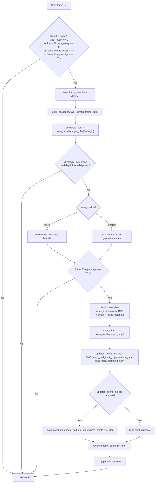
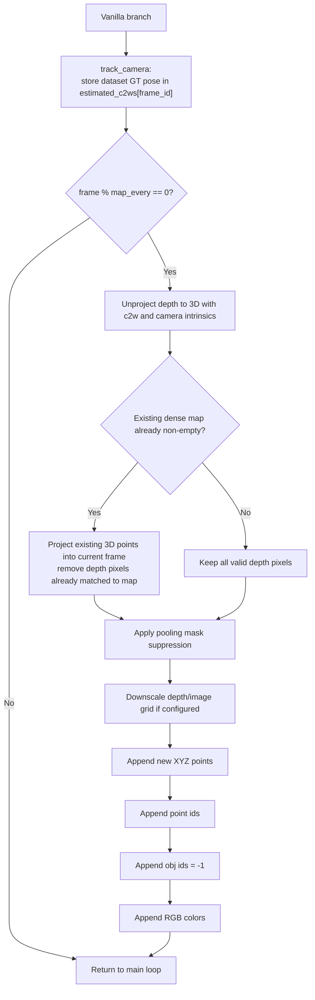
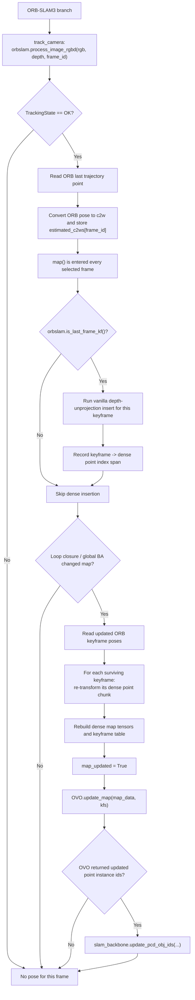
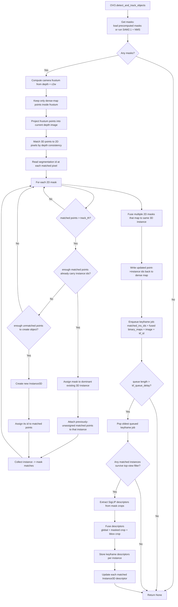
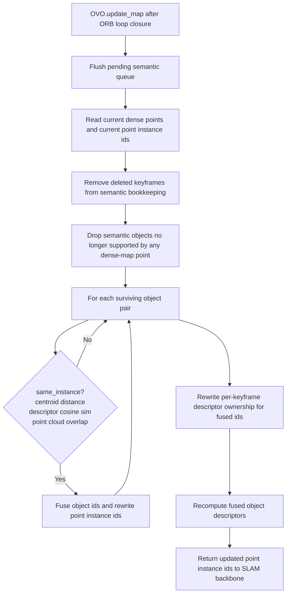

# OVO Per-Frame Pipeline

```mermaid
flowchart TD
    A["Start frame_id"] --> B{"Run this frame?<br/>track_every == 1<br/>or frame % track_every == 0<br/>or frame % map_every == 0<br/>or frame % segment_every == 0"}
    B -- No --> Z["Next frame"]
    B -- Yes --> C["Load frame_data from dataset"]
    C --> D["slam_backbone.track_camera(frame_data)"]
    D --> E["estimated_c2w = slam_backbone.get_c2w(frame_id)"]
    E --> F{"estimated_c2w exists<br/>and depth has valid pixels?"}
    F -- No --> Z
    F -- Yes --> G{"slam_module?"}
    G -- vanilla --> V["Run vanilla geometry branch"]
    G -- orbslam --> O["Run ORB-SLAM3 geometry branch"]
    V --> H
    O --> H
    H{"frame % segment_every == 0?"}
    H -- No --> Z
    H -- Yes --> I["Build scene_data<br/>frame_id + semantic RGB + depth + resize metadata"]
    I --> J["map_data = slam_backbone.get_map()"]
    J --> K["updated_points_ins_ids = OVO.detect_and_track_objects(scene_data, map_data, estimated_c2w)"]
    K --> L{"updated_points_ins_ids returned?"}
    L -- Yes --> M["slam_backbone.update_pcd_obj_ids(updated_points_ins_ids)"]
    L -- No --> N["Skip point-id update"]
    M --> P["OVO.compute_semantic_info()"]
    N --> P
    P --> Q["Logger memory stats"]
    Q --> Z
```

```mermaid
flowchart TD
    A["Vanilla branch"] --> B["track_camera:<br/>store dataset GT pose in estimated_c2ws[frame_id]"]
    B --> C{"frame % map_every == 0?"}
    C -- No --> X["Return to main loop"]
    C -- Yes --> D["Unproject depth to 3D with c2w and camera intrinsics"]
    D --> E{"Existing dense map already non-empty?"}
    E -- Yes --> F["Project existing 3D points into current frame<br/>remove depth pixels already matched to map"]
    E -- No --> G["Keep all valid depth pixels"]
    F --> H["Apply pooling mask suppression"]
    G --> H
    H --> I["Downscale depth/image grid if configured"]
    I --> J["Append new XYZ points"]
    J --> K["Append point ids"]
    K --> L["Append obj ids = -1"]
    L --> M["Append RGB colors"]
    M --> X
```

```mermaid
flowchart TD
    A["ORB-SLAM3 branch"] --> B["track_camera:<br/>orbslam.process_image_rgbd(rgb, depth, frame_id)"]
    B --> C{"TrackingState == OK?"}
    C -- No --> X["No pose for this frame"]
    C -- Yes --> D["Read ORB last trajectory point"]
    D --> E["Convert ORB pose to c2w and store estimated_c2ws[frame_id]"]
    E --> F["map() is entered every selected frame"]
    F --> G{"orbslam.is_last_frame_kf()?"}
    G -- Yes --> H["Run vanilla depth-unprojection insert for this keyframe"]
    H --> I["Record keyframe -> dense point index span"]
    G -- No --> J["Skip dense insertion"]
    I --> J
    J --> K{"Loop closure / global BA changed map?"}
    K -- No --> X
    K -- Yes --> L["Read updated ORB keyframe poses"]
    L --> M["For each surviving keyframe:<br/>re-transform its dense point chunk"]
    M --> N["Rebuild dense map tensors and keyframe table"]
    N --> O["map_updated = True"]
    O --> P["OVO.update_map(map_data, kfs)"]
    P --> Q{"OVO returned updated point instance ids?"}
    Q -- Yes --> R["slam_backbone.update_pcd_obj_ids(...)"]
    Q -- No --> X
    R --> X
```

```mermaid
flowchart TD
    A["OVO.detect_and_track_objects"] --> B["Get masks:<br/>load precomputed masks or run SAM2.1 + NMS"]
    B --> C{"Any masks?"}
    C -- No --> X["Return None"]
    C -- Yes --> D["Compute camera frustum from depth + c2w"]
    D --> E["Keep only dense-map points inside frustum"]
    E --> F["Project frustum points into current depth image"]
    F --> G["Match 3D points to 2D pixels by depth consistency"]
    G --> H["Read segmentation id at each matched pixel"]
    H --> I["For each 2D mask"]
    I --> J{"matched points > track_th?"}
    J -- No --> I
    J -- Yes --> K{"enough matched points already carry instance ids?"}
    K -- Yes --> L["Assign mask to dominant existing 3D instance"]
    L --> M["Attach previously-unassigned matched points to that instance"]
    K -- No --> N{"enough unmatched points to create object?"}
    N -- No --> I
    N -- Yes --> O["Create new Instance3D"]
    O --> P["Assign its id to matched points"]
    M --> Q["Collect instance -> mask matches"]
    P --> Q
    Q --> I
    I --> R["Fuse multiple 2D masks that map to same 3D instance"]
    R --> S["Write updated point->instance ids back to dense map"]
    S --> T["Enqueue keyframe job:<br/>matched_ins_ids + fused binary_maps + image + kf_id"]
    T --> U{"queue length > kf_queue_delay?"}
    U -- No --> X
    U -- Yes --> V["Pop oldest queued keyframe job"]
    V --> W{"Any matched instances survive top-view filter?"}
    W -- No --> X
    W -- Yes --> Y["Extract SigLIP descriptors from mask crops"]
    Y --> Z["Fuse descriptors<br/>global + masked crop + bbox crop"]
    Z --> AA["Store keyframe descriptors per instance"]
    AA --> AB["Update each matched Instance3D descriptor"]
    AB --> X
```

```mermaid
flowchart TD
    A["OVO.update_map after ORB loop closure"] --> B["Flush pending semantic queue"]
    B --> C["Read current dense points and current point instance ids"]
    C --> D["Remove deleted keyframes from semantic bookkeeping"]
    D --> E["Drop semantic objects no longer supported by any dense-map point"]
    E --> F["For each surviving object pair"]
    F --> G{"same_instance?<br/>centroid distance<br/>descriptor cosine sim<br/>point cloud overlap"}
    G -- No --> F
    G -- Yes --> H["Fuse object ids and rewrite point instance ids"]
    H --> F
    F --> I["Rewrite per-keyframe descriptor ownership for fused ids"]
    I --> J["Recompute fused object descriptors"]
    J --> K["Return updated point instance ids to SLAM backbone"]
```
